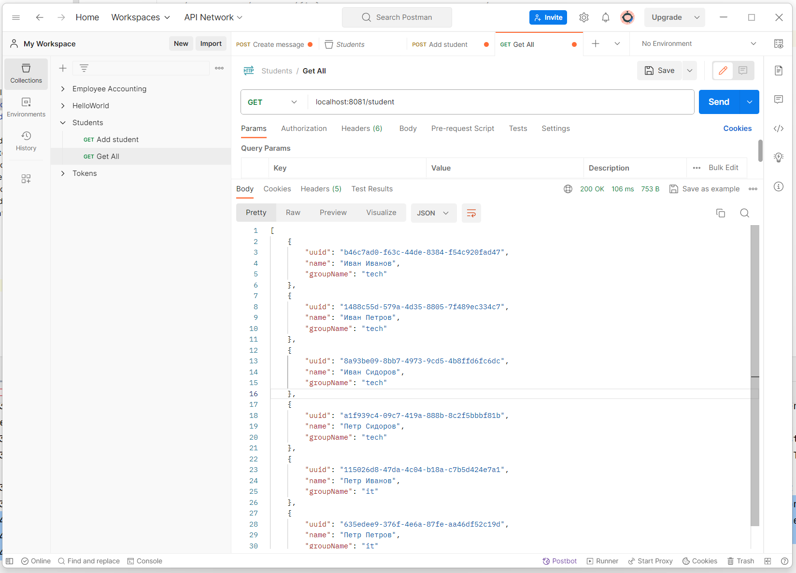
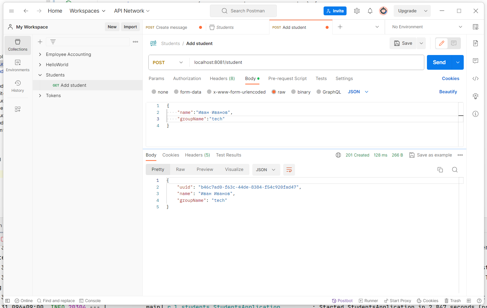
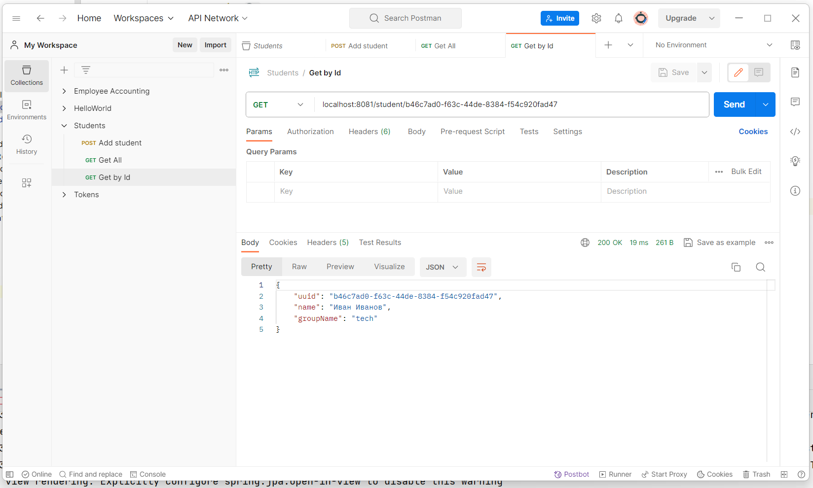
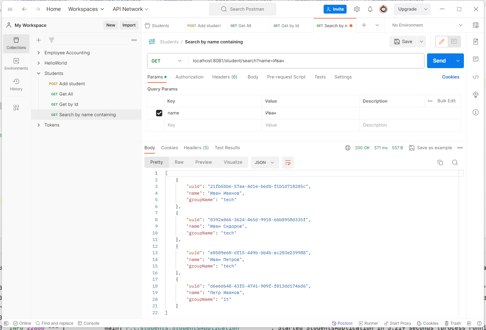
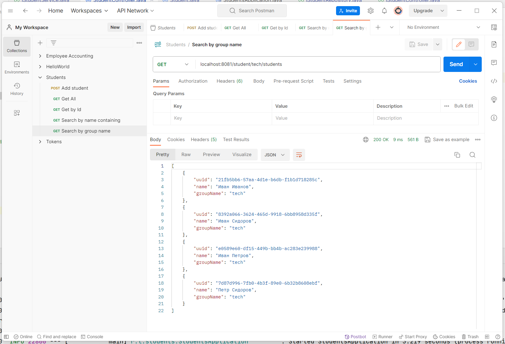
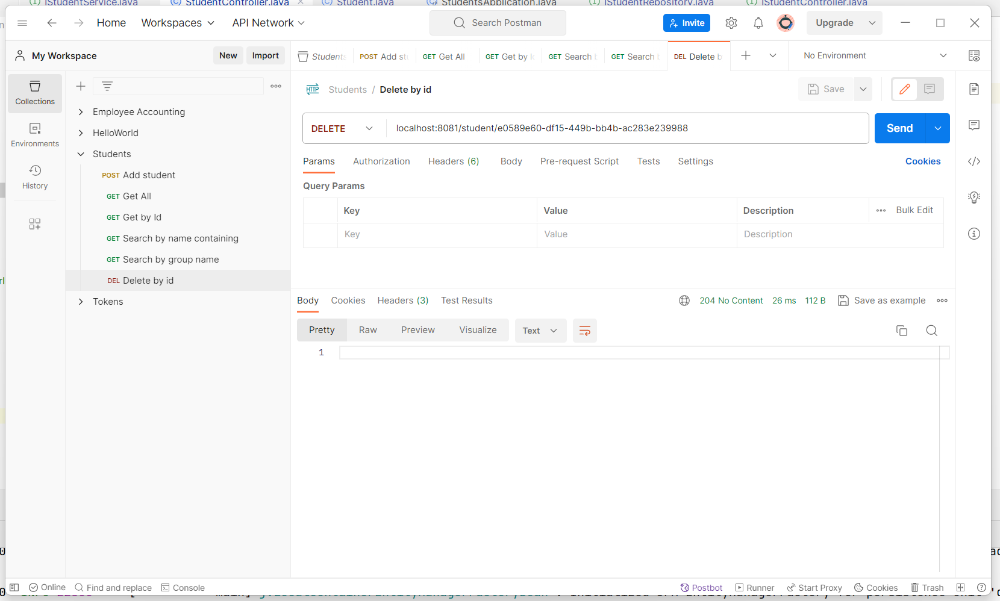

# Students
## Задание

1. Создать spring-boot приложение с помощью https://start.spring.io/
2. Создать Класс Student c полями: идентификатор, имя, имя группы
3. Создать контроллер, обрабатывающий входящие запросы:
* GET /student/{id} - получить студента по ID
* GET /student - получить всех студентов
* GET /student/search?name='studentName' - получить список студентов, чье имя содержит подстроку studentName
* GET /group/{groupName}/student - получить всех студентов группы
* POST /student - создать студента (принимает JSON) (отладиться можно с помощью Postman)
* DELETE /student/{id} - удалить студента
4. При старте приложения, в программе должно быть создано 5-10 студентов.

## Решение

Создаем spring-boot приложение со следующими зависимостями:

* spring-boot-starter-data-jpa
* com.h2database
* lombok

Создаем сущность Student

```java
@Data
@NoArgsConstructor
@Entity
public class Student implements Serializable {

    public Student(String name, String groupName) {
        this.name = name;
        this.groupName = groupName;
    }

    @Id
    @GeneratedValue
    private UUID uuid;

    private String name;
    private String groupName;
}
```

На старте заполняем БД набором данных при помощи CommandLineRunner

```java
@Service
public class CommandLineRunnerImpl implements CommandLineRunner {

    private final IStudentService studentService;

    @Autowired
    public CommandLineRunnerImpl(IStudentService studentService) {
        this.studentService = studentService;
    }

    @Override
    public void run(String... args) throws Exception {

        List<Student> students = new ArrayList<>(Arrays.asList(
                new Student("Иван Иванов", "tech"),
                new Student("Иван Сидоров", "tech"),
                ...

        students.forEach(studentService::save);
    }
}
```

Создаем репозиторий, имплементирующем JpaRepository. Добавляем методы для поиска по 
строке содержащейся в имени и названию группы

```java
Iterable<Student> findAllByNameContains(String name);
Iterable<Student> findAllByGroupName(String groupName);
```

Реализуем сервис StudentServiceImpl.java и контроллер StudentControllerImpl.java

## Работа приложения

Показать всех студентов



Создать



Найти по Id



Получить список студентов, чье имя содержит подстроку



Получить всех студентов группы



Удалить по Id

